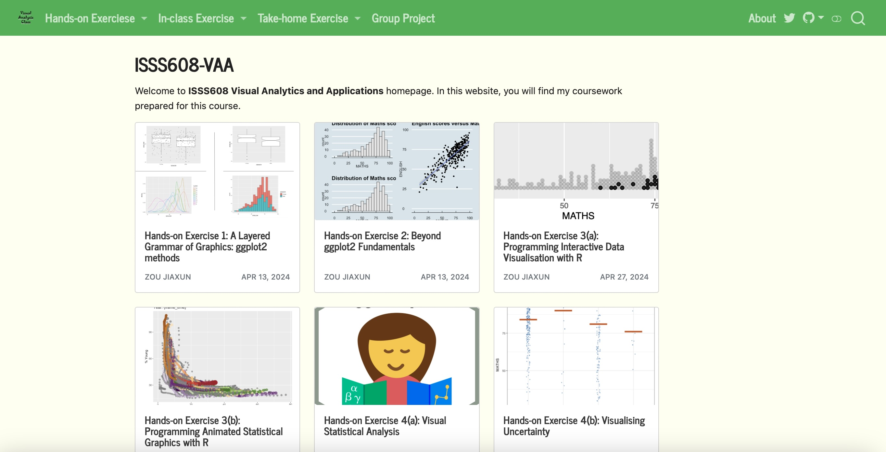

<!-- Include Font Awesome for icons -->
<link rel="stylesheet" href="https://cdnjs.cloudflare.com/ajax/libs/font-awesome/6.0.0-beta3/css/all.min.css">
<link href="https://fonts.googleapis.com/css2?family=Roboto&display=swap" rel="stylesheet">

  <!-- Main Content Section -->
  

    <section id="about">
      
<strong>Student</strong> 
      <strong>Singapore Management University, School of Computing and Information Systems</strong> 
      <strong>Pursuing Master of IT in Business (Analytics Track)</strong> 
      <em>Singapore</em>

      

      
I am currently a Master’s student at Singapore Management University, specializing in the Analytics Track of the Master of IT in Business (MITB) program. With a background in Business Administration and a deep interest in data-driven decision-making, I am passionate about leveraging data analytics to address complex business challenges.

    </section>

    <section id="experience">
      <h2>Experience</h2>

      

        Export Trader, Gaierpu International Trading Corporation 
        Jiangsu, China 
        Jun 2021 - Aug 2021 
        Collaborated with a team on inventory checks and customer engagement, securing a bulk order of 10,000 N95 masks and achieving 100% on-time delivery to enhance customer satisfaction.
      

      

        Account Assistant, Changzhou Jinbaihe 
        Jiangsu, China 
        Jun 2022 - Aug 2022 
        Recorded daily transactions, coordinated financial reporting with department managers, and analyzed statements. Helped increase cash flow by 12% through insights on abnormal data like high receivables.
      

      
      

        Assistant Analyst, J.P. Morgan 
        China (Remote Part-time) 
        Sep 2023 - Nov 2023 
        Collected financial data during the federal rate hike cycle, consolidating insights in the database. Conducted company research, analyzed market trends, and provided investment recommendations to the fund manager.
      

    </section>

<section id="projects">
  <h2>Projects</h2>

  

    <h3>Illegal Fish Company Business Activity Analysis (R)</h3>
    
    
Used Shiny to develop an interactive visual analytics tool to analyze and monitor corporate networks of fishery companies potentially involved in illegal, unreported, and unregulated (IUU) fishing activities. Processed a knowledge graph with data on companies, owners, employees, and financial status, transforming activities (nodes) and relationships (edges) into a structure suitable for network analysis. Utilized Centrality Analysis (Degree and Betweenness Centrality) to detect key entities with significant influence within the network, revealing ownership structures and transactional connections indicative of control.

  

  

    <h3>IBM Employee Estimated Value Analysis (Python)</h3>
    
Created a data-driven model to optimize EEV (Employee Estimated Value) for IBM by identifying high-impact factors affecting employee satisfaction. Implemented a Random Forest classifier to identify "at-risk" employees based on factors like job role, performance score, and satisfaction levels. Utilized K-means clustering to segment employees into distinct groups based on behavior patterns, tenure, and satisfaction scores, enabling targeted interventions for different employee profiles.

  

</section>

  

    <h3>IBM Employee Estimated Value Analysis (Python)</h3>
    
Created a data-driven model to optimize EEV (Employee Estimated Value) for IBM by identifying high-impact factors affecting employee satisfaction. Implemented a Random Forest classifier to identify "at-risk" employees based on factors like job role, performance score, and satisfaction levels. Utilized K-means clustering to segment employees into distinct groups based on behavior patterns, tenure, and satisfaction scores, enabling targeted interventions for different employee profiles.

  

</section>

<section id="skills">
  <h2>Skills</h2>
  <ul>
    <li><strong>R</strong></li>
    <li><strong>Quarto</strong></li>
    <li><strong>Spreadsheet</strong></li>
    <li><strong>Shiny</strong></li>
    <li><strong>Tableau</strong>: <a href="https://public.tableau.com/app/profile/jiaxun.zou/vizzes" target="_blank">Tableau Public Profile</a></li>
    <li><strong>SAS</strong></li>
    <li><strong>Python</strong></li>
    <li><strong>EViews</strong></li>
  </ul>
</section>

<section id="community">
  <h2>Community</h2>
  
Visit my community website: <a href="https://lizicup.netlify.app/" target="_blank">lizicup.netlify.app</a>

</section>

  <!-- Sidebar Section with Fixed Position and Centered Content -->
  

    
    <h2>Jiaxun Zou</h2>
    
<em>Whole life unshaken</em>

    <!-- Icons for Email, LinkedIn, and GitHub -->
    

      <a href="mailto:connect@zoujiaxun.com" style="margin-right: 10px; color: #333;">
        <i class="fas fa-envelope" style="font-size: 24px;"></i>
      </a>
      <a href="https://www.linkedin.com/in/zoujiaxun" style="margin-right: 10px; color: #333;">
        <i class="fab fa-linkedin" style="font-size: 24px;"></i>
      </a>
      <a href="https://github.com/Fnrion" style="color: #333;">
        <i class="fab fa-github" style="font-size: 24px;"></i>
      </a>
    

    <!-- Sidebar Navigation Links -->
    <ul style="list-style: none; padding: 0; text-align: center;">
    <li><a href="#about" class="sidebar-link">About</a></li>
    <li><a href="#experience" class="sidebar-link">Experience</a></li>
    <li><a href="#projects" class="sidebar-link">Projects</a></li>
    <li><a href="#skills" class="sidebar-link">Skills</a></li>
    <li><a href="#community" class="sidebar-link">Community</a></li>
    </ul>
  

<!-- JavaScript to Highlight Active Section in Sidebar -->
